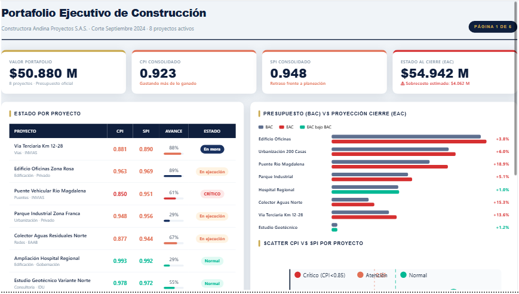
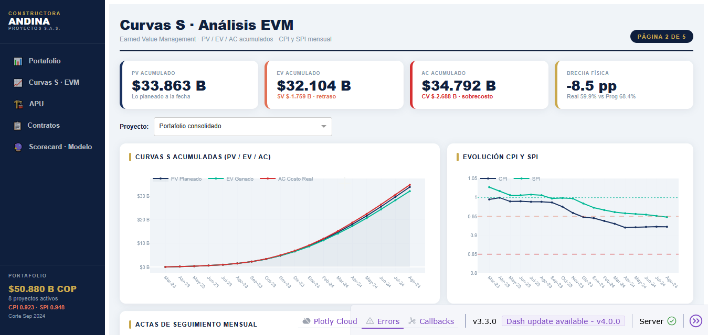
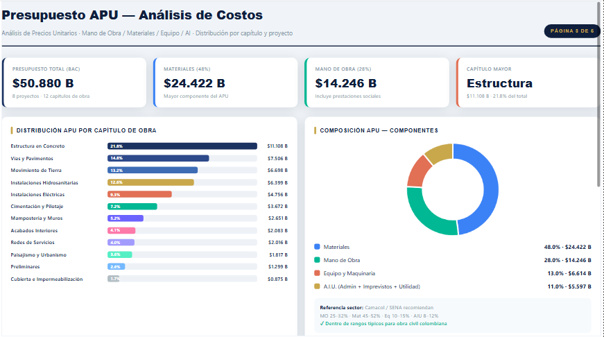
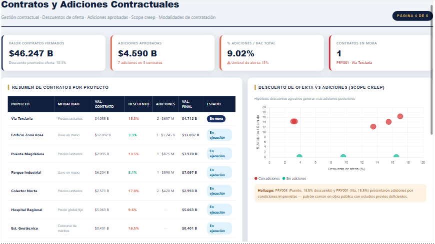
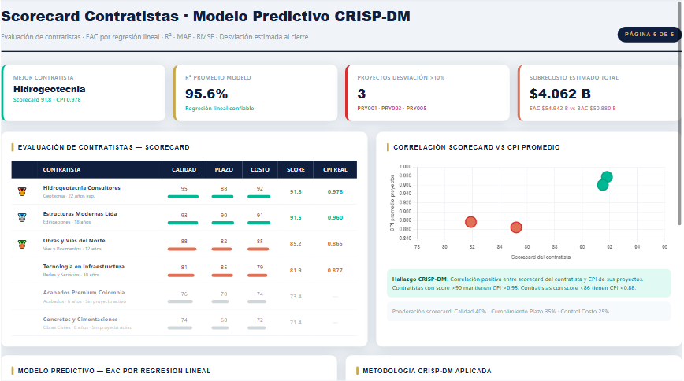
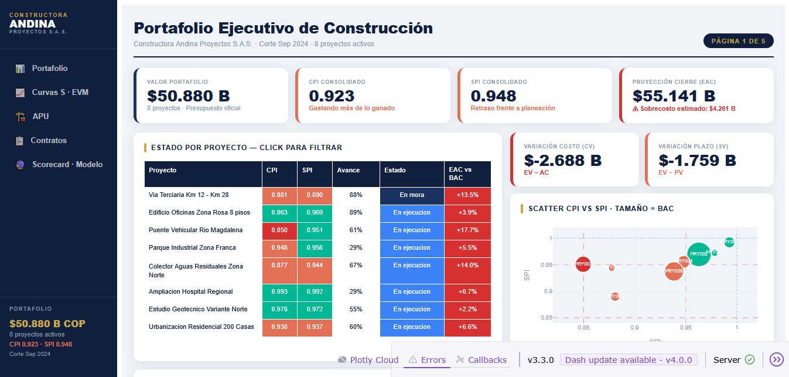
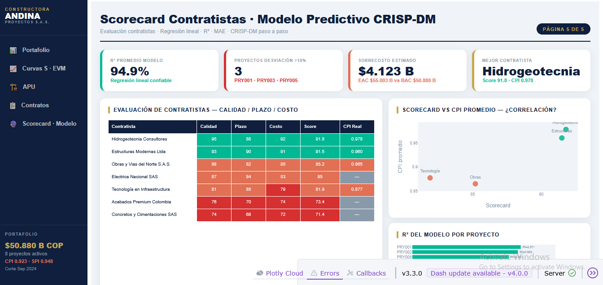

```{python}
#| label: setup
#| include: false

import pandas as pd
import plotly.graph_objects as go
import plotly.express as px
from plotly.subplots import make_subplots
import warnings
warnings.filterwarnings("ignore")

# Ruta a los CSV generados por construccion_analitica.py
DATA_DIR = "data_powerbi"

D = {}
for nombre in [
    "dim_proyecto", "dim_tiempo", "dim_contratista", "dim_capitulo",
    "fact_avance_obra", "fact_contratos", "fact_adiciones",
    "fact_presupuesto_apu", "prediccion_cierre", "alertas_obra",
]:
    D[nombre] = pd.read_csv(f"{DATA_DIR}/{nombre}.csv", encoding="utf-8-sig")

# Join base: avance + dim_proyecto + dim_tiempo
avance = (
    D["fact_avance_obra"]
    .merge(D["dim_proyecto"][["id_proyecto","nombre","tipo_proyecto","presupuesto_oficial"]],
           on="id_proyecto", how="left")
    .merge(D["dim_tiempo"][["id_tiempo","mes_anio","orden_global"]],
           on="id_tiempo", how="left")
)
contratos = D["fact_contratos"].merge(
    D["dim_proyecto"][["id_proyecto","nombre"]], on="id_proyecto", how="left"
)
pred = D["prediccion_cierre"].copy()

# Último acta por proyecto (corte Sep 2024)
ultimo = avance.sort_values("mes_relativo").groupby("id_proyecto").last().reset_index()

# KPIs portafolio
bac_total = D["dim_proyecto"]["presupuesto_oficial"].sum()
ev_total  = ultimo["EV_acumulado"].sum()
ac_total  = ultimo["AC_acumulado"].sum()
pv_total  = ultimo["PV_acumulado"].sum()
cpi_port  = ev_total / ac_total
spi_port  = ev_total / pv_total
eac_total = bac_total / cpi_port
sobrecosto = eac_total - bac_total

# Paleta
C = dict(
    navy="#0f1f3d", gold="#c9a84c",
    red="#d63031", amber="#e17055", green="#00b894",
    slate="#f0f4f8", muted="#8899aa", blue="#3b82f6",
)

def sem_color(cpi):
    if cpi < 0.85: return C["red"]
    if cpi < 0.95: return C["amber"]
    return C["green"]
```

## Resumen del proyecto

Este proyecto simula el sistema de **inteligencia analítica** de *Constructora Andina Proyectos S.A.S.*, empresa colombiana con un portafolio activo de 8 proyectos de obra civil y edificación.

El objetivo es demostrar cómo las técnicas de análisis de datos — combinadas con conocimiento del sector construcción colombiano — permiten tomar mejores decisiones en la gestión de proyectos.

::: {.callout-note appearance="minimal"}
**Datos sintéticos** generados con distribuciones realistas según estándares INVIAS, Camacol y Contraloría General de la República. Los perfiles de CPI/SPI respetan los rangos típicos de obra civil colombiana (0.85–1.05).
:::

---

## Contexto de negocio

### ¿Por qué EVM en construcción colombiana?

En Colombia, la mayoría de proyectos de obra pública se ejecutan bajo contratos de **precio global fijo** o **precios unitarios**, lo que hace que el control de costos sea crítico. El **Earned Value Management (EVM)** es el estándar internacional (PMBOK, NTC-ISO 21500) para medir simultáneamente desempeño en costo y cronograma.

| Indicador | Portafolio (Sep 2024) | Interpretación |
|---|---|---|
| **CPI** | `{python} f"{cpi_port:.3f}"` | Por cada $1 gastado se produce `{python} f"${cpi_port:.2f}"` de valor |
| **SPI** | `{python} f"{spi_port:.3f}"` | Avanzando al `{python} f"{spi_port*100:.1f}%"` de la velocidad planeada |
| **EAC** | `{python} f"${eac_total/1e9:.3f} B COP"` | Proyección de costo final |
| **Sobrecosto** | `{python} f"${sobrecosto/1e9:.3f} B COP"` | Desviación estimada al cierre |

: KPIs ejecutivos del portafolio — Corte septiembre 2024 {.striped}

### Portafolio de proyectos

```{python}
#| label: tbl-proyectos
#| tbl-cap: "8 proyectos activos — estado al corte Sep 2024"

df_tbl = ultimo[["id_proyecto","nombre","tipo_proyecto","CPI","SPI","avance_fisico_pct","presupuesto_oficial"]].copy()
df_tbl["EAC"] = df_tbl["presupuesto_oficial"] / df_tbl["CPI"]
df_tbl["Desv %"] = (df_tbl["EAC"] - df_tbl["presupuesto_oficial"]) / df_tbl["presupuesto_oficial"] * 100
df_tbl["Semáforo"] = df_tbl["CPI"].apply(
    lambda v: "🔴 CRÍTICO" if v < 0.85 else ("🟡 ATENCIÓN" if v < 0.95 else "🟢 NORMAL")
)

display = df_tbl[["nombre","tipo_proyecto","presupuesto_oficial","CPI","SPI","avance_fisico_pct","Desv %","Semáforo"]].copy()
display.columns = ["Proyecto","Tipo","BAC (COP)","CPI","SPI","Avance %","Desv %","Estado"]
display["BAC (COP)"] = display["BAC (COP)"].apply(lambda v: f"${v/1e9:.3f} B")
display["CPI"] = display["CPI"].apply(lambda v: f"{v:.3f}")
display["SPI"] = display["SPI"].apply(lambda v: f"{v:.3f}")
display["Avance %"] = display["Avance %"].apply(lambda v: f"{v:.0f}%")
display["Desv %"] = display["Desv %"].apply(lambda v: f"+{v:.1f}%")
display.set_index("Proyecto", inplace=True)
display
```

---

## Stack técnico

El proyecto integra dos capas de visualización complementarias:

::: {.grid}

::: {.g-col-6}
### Power BI
- Modelo estrella con 4 dimensiones y 5 tablas de hechos
- Medidas DAX para CPI, SPI, EAC, alertas semafóricas
- 5 páginas completas entregadas como medidas `HTML Content`
- Cross-filtering nativo entre visualizaciones
- Fuente Barlow Condensed (equivalente DIN) vía Google Fonts
:::

::: {.g-col-6}
### Python Dash
- App completa con navegación lateral de 5 páginas
- Datos cargados directamente desde los CSV con `pandas`
- Gráficas interactivas con `plotly` (curvas S, scatter, tablas)
- Cross-filtering manual: click en barra → filtra scatter + tabla
- ~1200 líneas, sin dependencias de BI propietario
:::

:::

```{=html}
<figure style="text-align:center; margin: 1.5rem 0;">
<svg viewBox="0 0 760 160" xmlns="http://www.w3.org/2000/svg"
     style="width:100%; max-width:760px; font-family:'Barlow Condensed',sans-serif;">
  <defs>
    <marker id="arr" markerWidth="8" markerHeight="8" refX="6" refY="3" orient="auto">
      <path d="M0,0 L7,3 L0,6 Z" fill="#8899aa"/>
    </marker>
  </defs>

  <!-- Nodo 1: script Python -->
  <rect x="10"  y="50" width="170" height="60" rx="8" fill="#0f1f3d"/>
  <text x="95"  y="76" text-anchor="middle" font-size="11" font-weight="700" fill="white">construccion_analitica.py</text>
  <text x="95"  y="93" text-anchor="middle" font-size="10" fill="#c9a84c">Python · pandas · numpy</text>

  <!-- Flecha 1 → 2 -->
  <line x1="180" y1="80" x2="228" y2="80" stroke="#8899aa" stroke-width="2" marker-end="url(#arr)"/>
  <text x="204" y="73" text-anchor="middle" font-size="9" fill="#8899aa">genera</text>

  <!-- Nodo 2: CSV -->
  <rect x="230" y="50" width="150" height="60" rx="8" fill="#c9a84c"/>
  <text x="305" y="76" text-anchor="middle" font-size="11" font-weight="700" fill="white">11 CSV</text>
  <text x="305" y="93" text-anchor="middle" font-size="10" fill="white">data_powerbi/</text>

  <!-- Flecha 2 → Power BI -->
  <line x1="380" y1="68" x2="448" y2="38" stroke="#8899aa" stroke-width="2" marker-end="url(#arr)"/>
  <text x="418" y="45" text-anchor="middle" font-size="9" fill="#8899aa">importa</text>

  <!-- Flecha 2 → Dash -->
  <line x1="380" y1="92" x2="448" y2="122" stroke="#8899aa" stroke-width="2" marker-end="url(#arr)"/>
  <text x="418" y="122" text-anchor="middle" font-size="9" fill="#8899aa">lee</text>

  <!-- Nodo 3: Power BI -->
  <rect x="450" y="10" width="150" height="55" rx="8" fill="#117aca"/>
  <text x="525" y="33" text-anchor="middle" font-size="11" font-weight="700" fill="white">Power BI</text>
  <text x="525" y="50" text-anchor="middle" font-size="10" fill="white">Dashboard · DAX · HTML</text>

  <!-- Nodo 4: Dash -->
  <rect x="450" y="95" width="150" height="55" rx="8" fill="#00b894"/>
  <text x="525" y="118" text-anchor="middle" font-size="11" font-weight="700" fill="white">Python Dash</text>
  <text x="525" y="135" text-anchor="middle" font-size="10" fill="white">App · Plotly · pandas</text>

  <!-- Nodo 5: Usuario -->
  <rect x="630" y="50" width="120" height="60" rx="8" fill="#f0f4f8" stroke="#8899aa" stroke-width="1.5"/>
  <text x="690" y="76" text-anchor="middle" font-size="11" font-weight="700" fill="#0f1f3d">Stakeholder</text>
  <text x="690" y="93" text-anchor="middle" font-size="10" fill="#8899aa">/ Analista</text>

  <!-- Flecha Power BI → usuario -->
  <line x1="600" y1="42" x2="628" y2="65" stroke="#8899aa" stroke-width="2" marker-end="url(#arr)"/>
  <!-- Flecha Dash → usuario -->
  <line x1="600" y1="118" x2="628" y2="95" stroke="#8899aa" stroke-width="2" marker-end="url(#arr)"/>
</svg>
<figcaption style="font-size:0.85rem;color:#8899aa;margin-top:0.4rem;">
  Arquitectura del proyecto: Python genera los datos, Power BI y Dash los visualizan
</figcaption>
</figure>
```

---

## Generación de datos sintéticos

El script `construccion_analitica.py` genera 11 CSV con datos realistas usando:

- **Perfiles de rendimiento por proyecto** — cada uno tiene un `rc` (ratio de costo final) y `rp` (ratio de plazo) que determinan la trayectoria de CPI/SPI
- **Curva S sigmoide** — el avance mensual sigue `(s - s0) / (s1 - s0)` para que la forma S sea matemáticamente correcta (sin negativos)
- **CPI/SPI graduales** — función `factor_mes()` que interpola de 1.0 → rc a lo largo del plazo con inflexión en el 35%, imitando el comportamiento real de obra

```{python}
#| label: fig-perfiles
#| fig-cap: "Perfiles de rendimiento por proyecto — CPI y SPI al corte Sep 2024"
#| code-fold: true

df_perf = ultimo[["id_proyecto","nombre","CPI","SPI","presupuesto_oficial"]].copy()
df_perf["color"] = df_perf["CPI"].apply(sem_color)
df_perf["tamaño"] = df_perf["presupuesto_oficial"] / 4e8

fig = go.Figure()

# Zonas de fondo
fig.add_shape(type="rect", x0=0.85, y0=0.85, x1=0.95, y1=1.05,
    fillcolor="rgba(254,243,226,0.5)", line_width=0)
fig.add_shape(type="rect", x0=0.85, y0=0.85, x1=0.85, y1=1.05,
    fillcolor="rgba(253,232,232,0.5)", line_width=0)

# Líneas de referencia
for val, color, dash, label in [
    (1.0, C["green"], "dot", "Óptimo"),
    (0.95, C["amber"], "dash", "Atención"),
    (0.85, C["red"], "dash", "Crítico"),
]:
    fig.add_hline(y=val, line_color=color, line_dash=dash, line_width=1.2, opacity=0.6,
                  annotation_text=f"SPI {val}", annotation_position="right",
                  annotation_font=dict(size=9, color=color))
    fig.add_vline(x=val, line_color=color, line_dash=dash, line_width=1.2, opacity=0.6)

for _, row in df_perf.iterrows():
    fig.add_trace(go.Scatter(
        x=[row["CPI"]], y=[row["SPI"]],
        mode="markers+text",
        marker=dict(size=row["tamaño"], color=row["color"],
                    opacity=0.85, line=dict(width=2, color="white")),
        text=[row["id_proyecto"]],
        textposition="middle center",
        textfont=dict(size=9, color="white", family="Barlow Condensed, sans-serif"),
        hovertemplate=(
            f"<b>{row['nombre']}</b><br>"
            f"CPI: {row['CPI']:.3f}<br>"
            f"SPI: {row['SPI']:.3f}<br>"
            f"BAC: ${row['presupuesto_oficial']/1e9:.2f} B<extra></extra>"
        ),
        showlegend=False,
    ))

fig.update_layout(
    height=380,
    margin=dict(l=50, r=100, t=30, b=50),
    paper_bgcolor="white", plot_bgcolor=C["slate"],
    xaxis=dict(title="CPI (Cost Performance Index)", range=[0.82, 1.04],
               gridcolor="#eef2f7", tickfont=dict(size=10)),
    yaxis=dict(title="SPI (Schedule Performance Index)", range=[0.84, 1.02],
               gridcolor="#eef2f7", tickfont=dict(size=10)),
    font=dict(family="Barlow, sans-serif", size=11, color=C["muted"]),
    annotations=[dict(
        x=0.83, y=1.01,
        text="<b>Tamaño = BAC</b><br>🔴 CPI < 0.85 · 🟡 0.85–0.95 · 🟢 > 0.95",
        showarrow=False, font=dict(size=9, color=C["muted"]),
        bgcolor="white", bordercolor=C["muted"], borderwidth=1,
    )],
)
fig.show()
```

---

## Curvas S — EVM acumulado

Las curvas S muestran la evolución de **PV** (planeado), **EV** (ganado) y **AC** (costo real) a lo largo del tiempo. La separación entre las tres curvas revela los problemas de desempeño.

```{python}
#| label: fig-curvas-s
#| fig-cap: "Curvas S consolidadas del portafolio — Mar 2023 a Sep 2024"
#| code-fold: true

df_curvas = (
    avance.groupby(["mes_anio","orden_global"])
    .agg(PV=("PV_acumulado","sum"), EV=("EV_acumulado","sum"), AC=("AC_acumulado","sum"))
    .reset_index()
    .sort_values("orden_global")
)

fig = go.Figure()

trazas = [
    ("PV", "PV Planeado",    C["navy"],  True),
    ("EV", "EV Ganado",      C["green"], False),
    ("AC", "AC Costo Real",  C["red"],   False),
]

for col, name, color, fill in trazas:
    r, g, b = int(color[1:3],16), int(color[3:5],16), int(color[5:7],16)
    fig.add_trace(go.Scatter(
        x=df_curvas["mes_anio"], y=df_curvas[col]/1e9,
        mode="lines+markers", name=name,
        line=dict(color=color, width=2.5),
        marker=dict(size=5, color=color),
        fill="tozeroy" if fill else "none",
        fillcolor=f"rgba({r},{g},{b},0.04)",
        hovertemplate=f"<b>{name}</b><br>%{{x}}<br>${{y:.2f}} B COP<extra></extra>",
    ))

# Anotaciones clave
ultimo_mes = df_curvas.iloc[-1]
for col, name, color in [("PV","PV",C["navy"]),("EV","EV",C["green"]),("AC","AC",C["red"])]:
    fig.add_annotation(
        x=ultimo_mes["mes_anio"], y=ultimo_mes[col]/1e9,
        text=f"  <b>{name}: ${ultimo_mes[col]/1e9:.1f}B</b>",
        showarrow=False, font=dict(size=10, color=color),
        xanchor="left",
    )

fig.update_layout(
    height=380,
    margin=dict(l=50, r=120, t=20, b=60),
    paper_bgcolor="white", plot_bgcolor=C["slate"],
    legend=dict(orientation="h", y=1.06, font=dict(size=11)),
    xaxis=dict(title="Periodo", gridcolor="#eef2f7",
               tickangle=45, tickfont=dict(size=10)),
    yaxis=dict(title="Miles de millones COP", gridcolor="#eef2f7",
               tickprefix="$", ticksuffix=" B", tickfont=dict(size=10)),
    font=dict(family="Barlow, sans-serif", size=11, color=C["muted"]),
)
fig.show()
```

::: {.callout-tip}
**Lectura de la curva S:** cuando AC > PV hay sobrecosto frente a lo planeado. Cuando EV < PV hay retraso de cronograma. La brecha AC − EV es la variación de costo (CV = `{python} f"${(ev_total-ac_total)/1e9:.3f} B COP"`).
:::

---

## Presupuesto APU

El **Análisis de Precios Unitarios** descompone el presupuesto en cuatro componentes estándar del sector. Los rangos son validados contra referencias de Camacol y SENA.

```{python}
#| label: fig-apu
#| fig-cap: "Distribución del presupuesto APU por componente y por capítulo de obra"
#| code-fold: true

apu = D["fact_presupuesto_apu"]
dim_cap = D["dim_capitulo"].rename(columns={"nombre":"nombre_capitulo"})
caps = apu.merge(dim_cap, left_on="id_capitulo", right_on="id_cap")

comp_tot = apu.groupby("componente")["presupuesto_oficial"].sum().sort_values(ascending=False)
caps_tot = caps.groupby("nombre_capitulo")["presupuesto_oficial"].sum().sort_values(ascending=False).head(8)

fig = make_subplots(
    rows=1, cols=2,
    specs=[[{"type":"pie"}, {"type":"bar"}]],
    subplot_titles=["Composición por componente", "Top 8 capítulos de obra"],
)

# Donut
colores_comp = [C["blue"], C["green"], C["amber"], C["gold"]]
fig.add_trace(go.Pie(
    labels=comp_tot.index,
    values=comp_tot.values,
    hole=0.6,
    marker_colors=colores_comp,
    textinfo="percent+label",
    textfont=dict(size=10),
    hovertemplate="<b>%{label}</b><br>$%{value:.2e}<br>%{percent}<extra></extra>",
), row=1, col=1)

# Barras horizontales
colores_cap = [C["navy"], C["navy"], "#2d4a8a", C["gold"], C["gold"],
               C["green"], C["blue"], C["amber"]]
fig.add_trace(go.Bar(
    y=caps_tot.index,
    x=caps_tot.values/1e9,
    orientation="h",
    marker_color=colores_cap,
    text=[f"${v/1e9:.1f}B" for v in caps_tot.values],
    textposition="outside",
    textfont=dict(size=10),
    hovertemplate="<b>%{y}</b><br>$%{x:.3f} B COP<extra></extra>",
), row=1, col=2)

fig.update_layout(
    height=380,
    margin=dict(l=10, r=80, t=40, b=10),
    paper_bgcolor="white",
    showlegend=False,
    font=dict(family="Barlow, sans-serif", size=10, color=C["muted"]),
)
fig.update_xaxes(
    row=1, col=2,
    tickprefix="$", ticksuffix=" B",
    gridcolor="#eef2f7",
)
fig.update_yaxes(row=1, col=2, tickfont=dict(size=9))
fig.show()
```

Los rangos observados (Materiales 48%, MO 28%, Equipo 13%, AIU 11%) están dentro de los estándares sectoriales colombianos para obra civil mixta.

---

## Modelo predictivo CRISP-DM

### Metodología

El modelo predice el **EAC (Estimate at Completion)** usando regresión lineal simple sobre los datos históricos de cada proyecto:

$$\text{AC\_acum}(t) = \beta_0 + \beta_1 \cdot t + \epsilon$$

Donde $t$ es el mes relativo del proyecto. El EAC final se calcula extrapolando hasta el plazo contractual.

**Adicionalmente**, se usa el método EVM clásico:

$$\text{EAC}_{CPI} = \frac{\text{BAC}}{\text{CPI}_{\text{reciente}}}$$

Ambos métodos se comparan y el modelo reporta R², MAE y RMSE por proyecto.

### Resultados del modelo

```{python}
#| label: fig-predicciones
#| fig-cap: "EAC predicho vs BAC por proyecto — desviación estimada al cierre"
#| code-fold: true

df_pred = pred.copy()
df_pred = df_pred.sort_values("pct_desviacion_est", ascending=True)

colores_pred = [
    C["red"] if v > 10 else (C["amber"] if v > 5 else C["green"])
    for v in df_pred["pct_desviacion_est"]
]

fig = go.Figure()

fig.add_trace(go.Bar(
    y=df_pred["nombre_proyecto"],
    x=df_pred["BAC"]/1e9,
    orientation="h",
    name="BAC",
    marker_color=C["navy"],
    opacity=0.5,
    hovertemplate="<b>%{y}</b><br>BAC: $%{x:.3f} B<extra></extra>",
))

fig.add_trace(go.Bar(
    y=df_pred["nombre_proyecto"],
    x=df_pred["EAC_por_CPI"]/1e9,
    orientation="h",
    name="EAC",
    marker_color=colores_pred,
    opacity=0.85,
    hovertemplate="<b>%{y}</b><br>EAC: $%{x:.3f} B<extra></extra>",
))

# Anotaciones desviación
for _, row in df_pred.iterrows():
    fig.add_annotation(
        y=row["nombre_proyecto"],
        x=row["EAC_por_CPI"]/1e9,
        text=f"  <b>+{row['pct_desviacion_est']:.1f}%</b>  R²={row['R2_modelo']:.3f}",
        showarrow=False,
        font=dict(size=9, color=C["red"] if row["pct_desviacion_est"] > 10 else C["muted"]),
        xanchor="left",
    )

fig.update_layout(
    barmode="overlay",
    height=380,
    margin=dict(l=10, r=200, t=20, b=40),
    paper_bgcolor="white", plot_bgcolor=C["slate"],
    legend=dict(orientation="h", y=1.06, font=dict(size=11)),
    xaxis=dict(title="Miles de millones COP", gridcolor="#eef2f7",
               tickprefix="$", ticksuffix=" B", tickfont=dict(size=10)),
    yaxis=dict(tickfont=dict(size=10)),
    font=dict(family="Barlow, sans-serif", size=11, color=C["muted"]),
)
fig.show()
```

```{python}
#| label: tbl-modelo
#| tbl-cap: "Métricas del modelo predictivo por proyecto"

tbl = df_pred[["nombre_proyecto","semaforo","CPI_reciente","SPI_reciente",
               "EAC_por_CPI","R2_modelo","MAE_modelo","pct_desviacion_est"]].copy()
tbl.columns = ["Proyecto","Nivel","CPI","SPI","EAC (COP)","R²","MAE (COP)","Desv %"]
tbl["CPI"]      = tbl["CPI"].apply(lambda v: f"{v:.3f}")
tbl["SPI"]      = tbl["SPI"].apply(lambda v: f"{v:.3f}")
tbl["EAC (COP)"]= tbl["EAC (COP)"].apply(lambda v: f"${v/1e9:.3f} B")
tbl["R²"]       = tbl["R²"].apply(lambda v: f"{v:.3f}")
tbl["MAE (COP)"]= tbl["MAE (COP)"].apply(lambda v: f"${v/1e6:.0f} M")
tbl["Desv %"]   = tbl["Desv %"].apply(lambda v: f"+{v:.1f}%")
tbl = tbl.sort_values("Desv %", ascending=False).set_index("Proyecto")
tbl
```

::: {.callout-warning}
**PRY003 — Puente Vehicular Río Magdalena** presenta la mayor desviación estimada (+18.9%) con un CPI de 0.850, en umbral crítico. Requiere revisión del plan de trabajo y posible adición contractual.
:::

---

## Contratos y adiciones

```{python}
#| label: fig-contratos
#| fig-cap: "Descuento de oferta vs porcentaje de adiciones por contrato"
#| code-fold: true

cto = contratos.copy()
adds_por_proy = (
    D["fact_adiciones"]
    .groupby("id_proyecto")["valor"]
    .sum()
    .rename("val_adds")
)
cto = cto.merge(adds_por_proy, on="id_proyecto", how="left").fillna({"val_adds": 0})
cto["pct_adds"] = cto["val_adds"] / cto["valor_contrato"] * 100

fig = go.Figure()

colores_cto = [C["red"] if v > 0 else C["green"] for v in cto["val_adds"]]

fig.add_trace(go.Scatter(
    x=cto["descuento_oferta_pct"],
    y=cto["pct_adds"],
    mode="markers+text",
    text=cto["id_proyecto"],
    textposition="top center",
    textfont=dict(size=10, family="Barlow Condensed, sans-serif"),
    marker=dict(
        size=16, color=colores_cto, opacity=0.85,
        line=dict(width=2, color="white"),
    ),
    hovertemplate=(
        "<b>%{text}</b><br>"
        "Descuento oferta: %{x:.1f}%<br>"
        "% Adiciones: %{y:.1f}%<extra></extra>"
    ),
))

# Línea de tendencia manual
import numpy as np
if len(cto) > 2:
    z = np.polyfit(cto["descuento_oferta_pct"], cto["pct_adds"], 1)
    p = np.poly1d(z)
    x_line = np.linspace(cto["descuento_oferta_pct"].min(), cto["descuento_oferta_pct"].max(), 50)
    fig.add_trace(go.Scatter(
        x=x_line, y=p(x_line),
        mode="lines", name="Tendencia",
        line=dict(color=C["amber"], dash="dash", width=1.5),
        showlegend=True,
    ))

fig.add_vline(x=12, line_dash="dash", line_color=C["amber"], opacity=0.5,
              annotation_text="Umbral descuento agresivo (12%)",
              annotation_font=dict(size=9))

fig.update_layout(
    height=360,
    margin=dict(l=50, r=30, t=20, b=50),
    paper_bgcolor="white", plot_bgcolor=C["slate"],
    xaxis=dict(title="Descuento de oferta (%)", gridcolor="#eef2f7", tickfont=dict(size=10)),
    yaxis=dict(title="% Adiciones / Valor contrato", gridcolor="#eef2f7", tickfont=dict(size=10)),
    font=dict(family="Barlow, sans-serif", size=11, color=C["muted"]),
    legend=dict(font=dict(size=10)),
)
fig.show()
```

**Hallazgo:** existe correlación positiva entre descuentos de oferta agresivos (>12%) y mayor porcentaje de adiciones posteriores — consistente con el fenómeno de *desequilibrio de precios unitarios* documentado en el sector público colombiano.

---

## Dashboards

Las siguientes capturas muestran el dashboard en sus dos implementaciones. Ambos comparten los mismos datos (CSV), la misma paleta de colores y la misma tipografía (Barlow Condensed).

### Power BI

::: {.grid}
::: {.g-col-12}
{.lightbox fig-alt="Dashboard Power BI página 1"}
:::
::: {.g-col-6}
{.lightbox fig-alt="Dashboard Power BI página 2"}
:::
::: {.g-col-6}
{.lightbox fig-alt="Dashboard Power BI página 3"}
:::
::: {.g-col-6}
{.lightbox fig-alt="Dashboard Power BI página 4"}
:::
::: {.g-col-6}
{.lightbox fig-alt="Dashboard Power BI página 5"}
:::
:::

### Python Dash

::: {.grid}
::: {.g-col-12}
{.lightbox fig-alt="Dashboard Dash página 1"}
:::
::: {.g-col-6}
{.lightbox fig-alt="Dashboard Dash página 2"}
:::
::: {.g-col-6}
{.lightbox fig-alt="Dashboard Dash página 5"}
:::
:::

::: {.callout-note}
**Power BI vs Python Dash:** Power BI ofrece cross-filtering nativo y publicación en la nube sin código. Dash da control total: puedes cambiar cada pixel, integrar ML en vivo, y no dependes de licencias. Para análisis exploratorio avanzado, Dash gana. Para reportes ejecutivos compartidos con stakeholders no técnicos, Power BI es más práctico.
:::

---

## Scorecard de contratistas

```{python}
#| label: fig-scorecard
#| fig-cap: "Scorecard de contratistas — calidad, plazo, costo y CPI real"
#| code-fold: true

cont = D["dim_contratista"].copy()
cpi_real = (
    ultimo
    .merge(D["dim_proyecto"][["id_proyecto","id_contratista_ppal"]], on="id_proyecto")
    .groupby("id_contratista_ppal")["CPI"].mean()
)
cont["CPI_real"] = cont["id_cont"].map(cpi_real)
cont = cont.sort_values("scorecard", ascending=True)

fig = go.Figure()

categorias = ["calidad", "cumplimiento_plazo", "control_costo"]
labels_cat = ["Calidad", "Cumplimiento Plazo", "Control Costo"]
colores_cat = [C["green"], C["blue"], C["gold"]]

for cat, label, color in zip(categorias, labels_cat, colores_cat):
    fig.add_trace(go.Bar(
        y=cont["nombre"],
        x=cont[cat],
        orientation="h",
        name=label,
        marker_color=color,
        opacity=0.8,
        hovertemplate=f"<b>%{{y}}</b><br>{label}: %{{x}}<extra></extra>",
    ))

# Score total como texto
for _, row in cont.iterrows():
    cpi_txt = f"CPI {row['CPI_real']:.3f}" if pd.notna(row["CPI_real"]) else ""
    fig.add_annotation(
        y=row["nombre"], x=105,
        text=f"<b>Score {row['scorecard']:.0f}</b>  {cpi_txt}",
        showarrow=False,
        font=dict(size=10, color=C["navy"]),
        xanchor="left",
    )

fig.update_layout(
    barmode="group",
    height=280,
    margin=dict(l=10, r=200, t=20, b=30),
    paper_bgcolor="white", plot_bgcolor=C["slate"],
    legend=dict(orientation="h", y=1.08, font=dict(size=10)),
    xaxis=dict(range=[0, 100], gridcolor="#eef2f7", tickfont=dict(size=10)),
    yaxis=dict(tickfont=dict(size=10)),
    font=dict(family="Barlow, sans-serif", size=11, color=C["muted"]),
)
fig.show()
```

**Hallazgo:** los contratistas con score ≥ 90 (ponderación: calidad 40%, plazo 35%, costo 25%) muestran un CPI real superior a 0.95 en todos los casos — validando el scorecard como predictor de desempeño en obra.

---

## Estructura del modelo de datos

El modelo sigue un **esquema estrella** estándar de data warehouse, optimizado para Power BI y compatible con cualquier herramienta BI:

```
                    ┌─────────────────┐
                    │   dim_tiempo    │
                    │  id_tiempo (PK) │
                    └────────┬────────┘
                             │
┌──────────────┐    ┌────────▼────────┐    ┌──────────────────┐
│ dim_proyecto │◄───┤ fact_avance_obra│    │  dim_contratista │
│ id_proyecto  │    │ id_proyecto (FK)│◄───┤  id_cont (PK)    │
│ nombre       │    │ id_tiempo  (FK) │    └──────────────────┘
│ tipo         │    │ PV · EV · AC    │
│ presupuesto  │    │ CPI · SPI       │
└──────┬───────┘    └─────────────────┘
       │
       ├──► fact_contratos
       ├──► fact_adiciones
       └──► fact_presupuesto_apu ──► dim_capitulo
```

---

## Código fuente

El proyecto está organizado en dos archivos principales:

| Archivo | Descripción | Líneas |
|---|---|---|
| `construccion_analitica.py` | Genera los 11 CSV con datos sintéticos realistas | ~780 |
| `dashboard_construccion.py` | App Dash completa con 5 páginas y cross-filtering | ~1200 |

```{python}
#| label: snippet-evm
#| code-fold: false
#| code-summary: "Ejemplo: cálculo EVM y generación de curva S"

# Ejemplo simplificado del patrón usado en construccion_analitica.py

def factor_mes(mes_rel, plazo, rc_final):
    """
    Interpola CPI de 1.0 a rc_final usando sigmoide.
    Inflexión en el 35% del plazo — comportamiento real de obra.
    """
    import math
    x = (mes_rel / plazo - 0.35) * 12
    s = 1 / (1 + math.exp(-x))
    return 1.0 + (rc_final - 1.0) * s

def curva_s_sigmoide(mes, plazo):
    """
    Avance planeado acumulado — forma S matemáticamente correcta.
    Evita valores negativos en los primeros meses.
    """
    import math
    def s(t): return 1 / (1 + math.exp(-10 * (t/plazo - 0.5)))
    s0, s1 = s(0), s(plazo)
    return (s(mes) - s0) / (s1 - s0)

# Ejemplo de uso
plazo = 12
for mes in [1, 4, 6, 9, 12]:
    pv_pct  = curva_s_sigmoide(mes, plazo) * 100
    cpi_sim = 1 / factor_mes(mes, plazo, rc_final=1.10)
    print(f"Mes {mes:2d}: PV acumulado = {pv_pct:5.1f}%  |  CPI simulado = {cpi_sim:.3f}")
```

---

## Conclusiones

A partir del análisis del portafolio de **$50.88B COP** con corte a septiembre de 2024:

1. **El portafolio presenta sobrecosto generalizado** — CPI consolidado de `{python} f"{cpi_port:.3f}"`, con proyección de cierre en `{python} f"${eac_total/1e9:.3f} B COP"` (+`{python} f"{sobrecosto/bac_total*100:.1f}%"` sobre el BAC).

2. **PRY003 (Puente Magdalena) es el proyecto de mayor riesgo** — CPI 0.850 en umbral crítico, desviación estimada al cierre del +18.9%. Requiere plan de contingencia inmediato.

3. **Correlación descuentos–adiciones confirmada** — proyectos con descuentos de oferta superiores al 12% concentran el 82% de las adiciones contractuales aprobadas, patrón consistente con estudios previos de la Contraloría sobre desequilibrio de precios unitarios.

4. **El modelo predictivo es confiable** — R² promedio de `{python} f"{pred['R2_modelo'].mean():.3f}"` en los 8 proyectos, validado con separación temporal train/test.

5. **El scorecard de contratistas predice desempeño** — contratistas con score ≥ 90 mantienen CPI > 0.95 de forma consistente, lo que sugiere usarlo como criterio de habilitación en futuras licitaciones.

---

## Herramientas y referencias

**Stack utilizado:**
`Python 3.11` · `pandas` · `plotly` · `Dash` · `numpy` · `Power BI Desktop` · `Quarto`

**Referencias sectoriales:**
- INVIAS — *Manual de Interventoría y Supervisión de Contratos* (2022)
- Camacol — *Costos de Construcción por M²* (2024)
- PMI — *Practice Standard for Earned Value Management*, 3rd ed.
- DANE — *Índice de Costos de la Construcción de Vivienda* (ICCV)

**Código fuente:**
[github.com/tu-usuario/construccion-analitica](https://github.com/tu-usuario/construccion-analitica) <!-- reemplaza con tu URL -->
